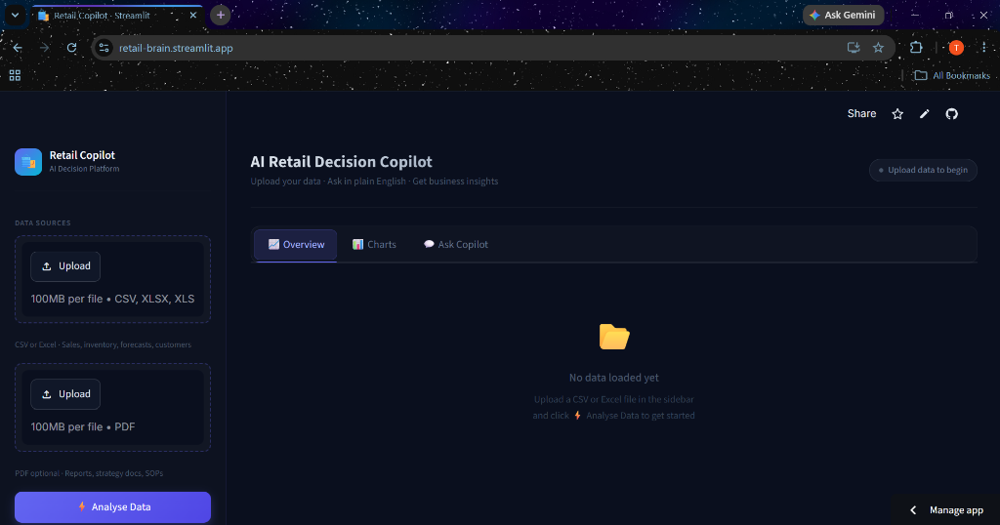
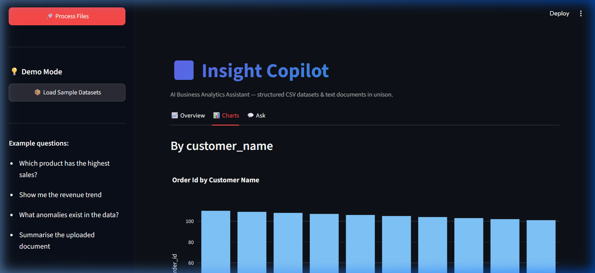
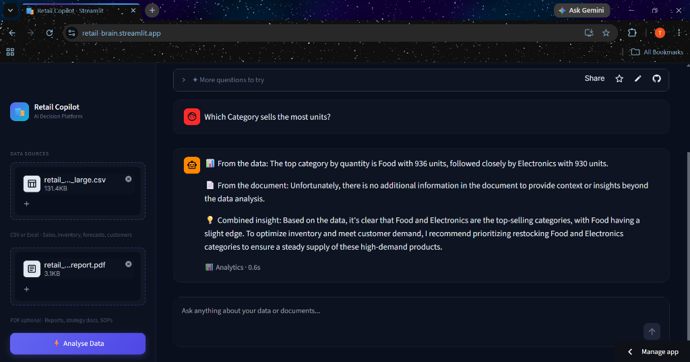

# 🛍️ RetailBrain

### *An AI-Powered Business Decision Copilot for Intelligent Business Analytics and Retrieval-Augmented Generation (RAG)*

---

[](https://www.python.org/)
[](https://streamlit.io/)
[](https://github.com/langchain-ai/langgraph)
[](LICENSE)
[](https://github.com/tanishkaarora/retailbrain/releases)
[](https://github.com/tanishkaarora/retailbrain/commits/main)

---

## 📌 Table of Contents
- [🌐 Live Demo](#-live-demo)
- [📖 Project Overview](#-project-overview)
- [🎯 Problem Statement](#-problem-statement)
- [✨ Key Features](#-key-features)
- [🏗️ System Architecture](#-system-architecture)
- [🧠 Why LangGraph?](#-why-langgraph)
- [💡 Why Hybrid Analytics?](#-why-hybrid-analytics)
- [🛠️ Technology Stack](#-technology-stack)
- [📂 Folder Structure](#-folder-structure)
- [📊 Data Sources](#-data-sources)
- [🚀 Getting Started](#-getting-started)
- [🌐 Deployment](#-deployment)
- [📖 Usage Guide](#-usage-guide)
- [❓ Example Questions](#-example-questions)
- [🖼️ Screenshots](#-screenshots)
- [🧪 Testing](#-testing)
- [📝 Architecture Decision Records (ADRs)](#-architecture-decision-records-adrs)
- [🕵️ Mini-Extension: Smart Column Detective](#-mini-extension-smart-column-detective)
- [🧠 What I Learned (Weekly Reflections)](#-what-i-learned-weekly-reflections)
- [⚠️ Known Limitations](#-known-limitations)
- [🗺️ 3rd Year Extension Roadmap](#%EF%B8%8F-3rd-year-extension-roadmap)
- [⚡ Performance](#-performance)
- [🔒 Security](#-security)
- [🙋 FAQ](#-faq)
- [🤝 Contributing](#-contributing)
- [📄 License](#-license)
- [👤 Author](#-author)
- [💖 Acknowledgements](#-acknowledgements)

---

## 🌐 Live Demo

* **Live Application URL:** [retail-brain.streamlit.app](https://retail-brain.streamlit.app/)
* **Demo Video:** Coming Soon *[🎥 Project Video](https://drive.google.com/file/d/1YMDQoao-oXjO3AycraRQsNonZU-uxoig/view?usp=drivesdk)*

---

## 📖 Project Overview
**RetailBrain** is an AI-powered business decision copilot designed for retail operators and managers. It merges structured financial sales datasets and unstructured business strategy/report documents into a single, unified conversational interface. 

Instead of jumping between spreadsheet pivot tables and dense strategy PDFs, retail managers can ask natural language questions and receive mathematically precise analytics, contextual text citations, and auto-generated data visualizations.

---

## 🎯 Problem Statement
In modern retail management, decision-makers are constantly inundated with two disjointed data streams:
1. **Structured Data**: Raw spreadsheets detailing transaction logs, profit metrics, and inventory categories.
2. **Unstructured Data**: Strategic guidelines, PDF market research reports, supplier contracts, and regional performance reviews.

Traditional business intelligence (BI) dashboards only handle structured charts, while general-purpose document chat tools cannot perform mathematical computations over spreadsheets. Handoffs between these databases lead to high operational overhead, analysis latency, and hallucinated calculations by LLMs. **RetailBrain** solves this gap by uniting analytical computing and semantic RAG retrieval under a single, non-linear state manager.

---

## ✨ Key Features

| Feature | Description |
| :--- | :--- |
| **Analytics Engine** | Performs Category Performance Rankings, Monthly Growth Trends, and Statistical Anomaly Detection using Pandas and NumPy. |
| **Retrieval-Augmented Generation (RAG)** | Chunks, embeds, and queries text from strategy documents using local vector databases. |
| **Natural Language Querying** | Translates conversational queries into precise analytical and semantic searches. |
| **LangGraph Workflow** | Manages intent routing and multi-node execution state using Pydantic state graphs. |
| **Document Search** | Extracts source names, page numbers, and snippet citations from indexed PDFs. |
| **Business Insights** | Combines statistical calculations and strategy context into cited business recommendations. |
| **Interactive Dashboard** | Renders Plotly Express data visualizations dynamically based on computed statistics. |
| **Suggested Questions** | Recommends context-aware retail analysis questions dynamically matching the uploaded files. |

---

## 🏗️ System Architecture

RetailBrain uses a non-linear flow managed by **LangGraph**. The workflow progresses as follows:

```
User Query (Text / File Upload)
       │
       ▼
┌────────────────────────────────────────────────────────┐
│                      Streamlit UI                      │
└────────────────────────────────────────────────────────┘
       │
       ▼
┌────────────────────────────────────────────────────────┐
│                LangGraph State Machine                 │
│                                                        │
│                  1. Intent Router                      │
│                          │                             │
│             ┌────────────┴────────────┐                │
│             ▼                         ▼                │
│      AnalyticsNode                 RAGNode             │
│      (Pandas Engine)          (FAISS Retriever)        │
│             │                         │                │
│             └────────────┬────────────┘                │
│                          ▼                             │
│                  2. Synthesiser                        │
└────────────────────────────────────────────────────────┘
       │
       ▼
┌────────────────────────────────────────────────────────┐
│                   Groq LLM Service                     │
│               (Llama 3.1 8B Inference)                 │
└────────────────────────────────────────────────────────┘
       │
       ▼
Streamlit Dashboard Output (Citations + Plotly Chart)
```

### Complete Control Flow:
1. **User Submission**: The user uploads a CSV/PDF in the Streamlit Sidebar.
2. **Intent Classification**: The query is routed to the `IntentRouterNode` inside LangGraph. The node queries the LLM to classify the query as `analytics`, `rag`, `both`, or `general`.
3. **Execution Routing**:
   * **Analytics Pathway**: If the route is `analytics` or `both`, the `AnalyticsNode` executes, pulling the dataset from the session state to perform statistical analysis.
   * **RAG Pathway**: If the route is `rag` or `both`, the `RAGNode` runs, querying the local FAISS vector store for semantic matches.
4. **Synthesis Node**: The outputs are aggregated in the `CopilotState`. The `SynthesiserNode` invokes the LLM to combine numbers, strategy context, and source pages into a formatted business brief.
5. **Chart Generation**: If analytics were computed, the Streamlit frontend triggers the `ChartGenerator` to dynamically display matching Plotly Express charts.

---

## 🧠 Why LangGraph?
Traditional LLM frameworks use linear, sequential chains (`Prompt -> LLM -> Output`). However, real-world business copilots require conditional, branching, and cyclic logic:
* **Conditional Logic**: A user asking about sales data should not trigger the document indexer. LangGraph evaluates query intent at run-time and opens only the necessary paths.
* **State Preservation**: The `CopilotState` acts as a single source of truth across all nodes, preventing context loss during multi-stage routing.
* **Complex Merging**: For queries requiring both structured calculations and strategic recommendations, LangGraph runs paths in parallel and joins them cleanly in the synthesizer.

---

## 💡 Why Hybrid Analytics?
LLMs are notoriously bad at math. Asking a language model to directly compute sums, averages, or percentage growth rates over millions of rows of data inevitably leads to **hallucinations**. 

**RetailBrain** uses a hybrid approach:
1. **Precise Computations**: Raw numbers, trend tables, and statistical anomalies are computed programmatically using **Pandas** and **NumPy**.
2. **LLM Contextualization**: The precise outputs (tables and summaries) are fed into the LLM as textual context.
3. **Outcome**: The LLM writes the narrative explanation, while the numbers remain 100% mathematically correct.

---

## 🛠️ Technology Stack

| Component | Technology Choice | Role & Rationale |
| :--- | :--- | :--- |
| **Language** | Python 3.11+ | Industry-standard language for data engineering and ML. |
| **Frontend** | Streamlit 1.58.0 | Enables fast, responsive Python-based dashboards. |
| **Orchestration** | LangGraph 1.2.6 | State-based graph orchestration for non-linear agents. |
| **Chains & Clients** | LangChain 1.3.11 | Wrappers and connectors for LLMs and document utilities. |
| **Vector Index** | FAISS (Local CPU) | High-speed local similarity search vector store. |
| **Embeddings** | HuggingFace (BGE-small) | Highly ranked, CPU-friendly text encoder running locally. |
| **LLM Provider** | Groq Cloud API | High-throughput, sub-second latency Llama 3.1 inference. |
| **Data Engine** | Pandas 2.2.3 | Standard library for tabular dataset manipulation. |
| **Math Operations** | NumPy 1.26.x | Underpins statistical computations and anomaly bounds. |
| **Visualizations** | Plotly Express 6.5.0 | Renders premium, interactive charts native to Streamlit. |

---

## 📂 Folder Structure

```text
retailbrain/
├── .streamlit/
│   └── config.toml           # Streamlit UI theme and server configuration
├── assets/
│   └── copilot_demo.webp     # Visual asset for demo screens
├── data/
│   └── sample_retail.csv     # Fallback local testing CSV data
├── docs/
│   ├── adr/
│   │   ├── ADR-001.md        # Architecture Decision: LangGraph
│   │   ├── ADR-002.md        # Architecture Decision: FAISS
│   │   └── ADR-003.md        # Architecture Decision: Streamlit
│   ├── architecture.md       # High-level architecture documentation
│   ├── deployment.md         # Deployment and troubleshooting guide
│   └── design_doc.md         # Initial project specifications and requirements
├── sample_data/
│   └── sample_sales.csv      # Sample sales dataset for user uploads
├── src/
│   ├── __init__.py
│   ├── analytics/
│   │   ├── analytics_engine.py  # Trend, Category, and Anomaly computations
│   │   ├── chart_generator.py   # Plotly chart generators
│   │   ├── column_detective.py  # Conversational synonym column mapper
│   │   └── data_ingester.py     # CSV parsing, currency cleaning, profiling
│   ├── config/
│   │   └── config.py            # Safe-thread configs and LLM cached wrappers
│   ├── document_ingestion/
│   │   └── document_processor.py # PDF extraction and chunking pipeline
│   ├── graph_builder/
│   │   └── graph_builder.py     # LangGraph workflow definition
│   ├── node/
│   │   ├── analytics_node.py    # Analytics calculation coordinator
│   │   ├── intent_router.py     # LLM router classification wrapper
│   │   └── synthesiser_node.py  # LLM answer synthesiser and citation formatter
│   ├── state/
│   │   └── copilot_state.py     # LangGraph state schema definition
│   ├── utils/
│   │   └── mock_llm.py          # Offline mock LLM handler
│   └── vectorstore/
│       └── vectorstore.py       # FAISS embeddings database controller
├── tests/
│   ├── test_column_detective.py # Unit tests for Smart Column Detective
│   ├── test_data_ingester.py    # Unit tests for dataset cleaning
│   └── test_graph_flow.py       # Tests for intent routing and fallbacks
├── .env.example              # Template for environment variables
├── .gitignore
├── LICENSE                   # MIT License
├── README.md
├── run_tests.py              # Main test runner script
├── streamlit_app.py          # Streamlit UI dashboard and entry point
└── requirements.txt          # Pinned project dependencies
```

---

## 📊 Data Sources
* **Tabular Datasets (CSV/Excel)**:
  * Must contain transactional columns such as dates, product names/categories, unit sales, and revenue/profit.
  * *Sample Dataset Provided:* [sample_data/sample_sales.csv](file:///c:/Users/HP/OneDrive/Desktop/ai%20copilot/sample_data/sample_sales.csv)
* **Strategy Documents (PDF)**:
  * Text-based PDF files containing strategy guidelines, supplier contracts, or business performance notes.
* **Ingestion Assumptions**:
  * Date fields are parsed automatically.
  * Currencies (e.g. `$`, `€`, `Rs.`) are converted to clean numerical floats automatically.

---

## 🚀 Getting Started

### Prerequisites
* Python 3.11 or higher installed on your local machine.
* A Groq API Key (get one free at [console.groq.com](https://console.groq.com)).

### 1. Clone and Navigate
```bash
git clone https://github.com/tanishkaarora/retailbrain.git
cd retailbrain
```

### 2. Create and Activate Virtual Environment
```powershell
# Create environment
python -m venv .venv

# Windows activation
.venv\Scripts\Activate.ps1

# Mac/Linux activation
source .venv/bin/activate
```

### 3. Install Dependencies
```bash
pip install -r requirements.txt
```

### 4. Configure Environment Variables
Create a `.env` file in the root directory by copying the example:
```bash
copy .env.example .env
```
Open `.env` and fill in your keys:
```env
GROQ_API_KEY="your-groq-api-key-here"
USE_GROQ=true
USE_GEMINI=false
```

### 5. Launch the Application
```bash
streamlit run streamlit_app.py
```
Open `http://localhost:8501` in your browser.

---

## 🌐 Deployment

This application is ready for production and is deployed on **Streamlit Community Cloud**.

### Secrets Configuration on Streamlit Cloud
1. Go to your app dashboard settings on Streamlit Community Cloud.
2. Select the **Secrets** tab on the sidebar.
3. Paste the following configuration (replace with your active API keys):
   ```toml
   GROQ_API_KEY = "your-groq-key-here"
   USE_GROQ = "true"
   USE_GEMINI = "false"
   ```
4. Click **Save**. The app will pick up the secrets and run.

*For extensive troubleshooting details, see [docs/deployment.md](file:///c:/Users/HP/OneDrive/Desktop/ai%20copilot/docs/deployment.md).*

---

## 📖 Usage Guide

### 1. Ingestion
1. Expand the sidebar (click `»` if collapsed).
2. Upload a sales CSV file under **Upload Sales Dataset**.
3. Upload a retail report PDF under **Upload Business Report**.
4. Click **⚡ Analyse Data / Process Files** to trigger ingestion.

### 2. Overview Tab
Review the overall KPIs calculated from the spreadsheet (Total Revenue, Transaction Count, Date ranges, and numeric profiles).

### 3. Charts Tab
Examine the automatically selected and generated Plotly charts representing categories and sales volumes.

### 4. Ask Copilot Tab
Type natural language queries inside the chat window. The copilot will classify and retrieve numbers/strategic details automatically.

---

## ❓ Example Questions
* **Structured queries**:
  * *"What are my top-selling product categories by revenue?"*
  * *"Show me the anomaly points in monthly sales."*
* **Unstructured queries**:
  * *"Summarize the supplier delivery strategy from the document."*
  * *"What are the key retail marketing recommendations?"*
* **Hybrid queries**:
  * *"Why did sales dip in November, and what does the strategy document recommend for Q4?"*

---

## 🖼️ Screenshots

### Overview Dashboard


### Auto-Generated Interactive Charts


### Semantic RAG Ask Interface


---

## 🧪 Testing
The repository includes a comprehensive test suite covering data conversion, column mapping, routing, and RAG retrieval nodes.

To execute tests:
```bash
python run_tests.py
```
*Tests verify dataset ingestion, currency cleansing, column mapping algorithms, and LangGraph intent routing.*

---

## 📝 Architecture Decision Records (ADRs)
We document critical engineering choices using ADRs. The full records are located under `/docs/adr/`:
- 📄 **[ADR-001: LangGraph Adoption](file:///c:/Users/HP/OneDrive/Desktop/ai%20copilot/docs/adr/ADR-001.md)** — Decision to use LangGraph StateGraphs instead of linear chains for state control.
- 📄 **[ADR-002: In-Memory FAISS Indexing](file:///c:/Users/HP/OneDrive/Desktop/ai%20copilot/docs/adr/ADR-002.md)** — Choice of a local, zero-infra FAISS database for session-based vector retrieval.
- 📄 **[ADR-003: Streamlit UI Framework](file:///c:/Users/HP/OneDrive/Desktop/ai%20copilot/docs/adr/ADR-003.md)** — Decision to host a rapid-prototype UI inside Streamlit for accelerated evaluation.

---

## 🕵️ Mini-Extension: Smart Column Detective
The **Smart Column Detective** resolves gaps between human conversational terms and actual spreadsheet columns:
1. **Rule-Based Mapping**: Analyzes column headers for regex synonyms (e.g. mapping "Sales", "Earnings", or "Revenue" to `total_sales`).
2. **LLM-Based Mapping**: If rules fail, the detective sends the schema profile to the LLM to identify categoricals, timestamps, and metric fields.
3. **UI Transparency**: Displays mapping confidence and mapping choices directly in the sidebar, preventing calculation crashes on non-standard CSV headers.

---

## 🧠 What I Learned (Weekly Reflections)

### Week 1: Foundation
* Setting up a clean file architecture is critical before starting any agent development.
* Keeping LLM prompt templates decoupled from function logic under `src/prompts/` avoids code clutter.

### Week 2: Core Routing
* LangGraph state modifications must happen via explicit returned state updates from nodes, not by changing thread variables.
* Metaclass wrappers are required in Streamlit to manage environment configurations safely without cross-session pollution.

### Week 3: Testing & Polish
* Streamlit caching is dependent on hashable objects. Passing raw Pandas DataFrames breaks `@st.cache_data`. Passing file byte arrays instead resolves cache serialization.
* Standard `print()` outputs are buffered inside Streamlit containers; debugging outputs must be sent to `sys.stderr` to bypass buffer latency and display immediately in the cloud panel.

### Week 4: Deployment
* Containerized Streamlit deployment dashboards require strict secrets binding in TOML format to prevent credentials leaks.
* Wrapping third-party imports in try-except blocks ensures robustness against cloud resolver bugs.

---

## ⚠️ Known Limitations
* **Single-File Scope**: The application supports exactly one CSV and one PDF upload per user session.
* **Ephemeral In-Memory DB**: The vector database and uploaded files live in-memory and reset on web page refreshes.
* **No Authentication**: The interface is an open dashboard; no login or multi-tenant workspaces are implemented in this build.
* **Token Budget Summary**: Large tables are summarized into schemas and statistical profiles before being sent to the LLM to avoid context window overflow.

---

## 🗺️ 3rd Year Roadmap

RetailBrain will continue evolving into a production-ready AI Business Intelligence platform.

- **Version 1.1:** Multi-file support, persistent vector database (ChromaDB/Qdrant), and enhanced dashboards.
- **Version 1.2:** Conversational memory, authentication, natural language to SQL, and sales forecasting.
- **Version 2.0:** Multi-agent architecture, FastAPI + React, Docker, CI/CD, cloud deployment, and support for multiple business domains.

**Long-Term Vision:** Build an enterprise-grade AI Business Intelligence platform that combines analytics, RAG, and AI agents to deliver intelligent, data-driven business insights.

---

## ⚡ Performance
* **Encoder**: BGE-small embedding model runs locally on CPU, generating 384-dimension vectors in less than 50ms.
* **Vector Store**: FAISS similarity search takes less than 10ms for a 100-page document block.
* **LLM Output Latency**: Groq Llama 3.1 8B produces streaming output speeds exceeding 250 tokens per second.

---

## 🔒 Security
* **Zero Keys Committed**: No API keys are hardcoded. Local configurations read from `.env` (which is excluded via `.gitignore`).
* **Production Secrets**: Streamlit Cloud deployments read API keys from secured environment secrets.
* **Data Privacy**: Local vector databases and pandas operations are run in memory and are never sent to external vector clouds.

---

## 🙋 FAQ

**Q: Can I upload my own custom CSV?**  
A: Yes! The *Smart Column Detective* will automatically profile your dataset and map column headers to run correct analytics.

**Q: Which LLMs are supported?**  
A: Llama 3.1 8B via Groq is default and recommended. Gemini 1.5 Flash is supported as an alternative.

**Q: Can I deploy this myself?**  
A: Absolutely. Fork the repository and follow the Streamlit Cloud instructions in the deployment section.

---

## 🤝 Contributing
1. Fork this repository.
2. Create your feature branch (`git checkout -b feature/AmazingFeature`).
3. Commit your changes (`git commit -m 'Add some AmazingFeature'`).
4. Push to the branch (`git push origin feature/AmazingFeature`).
5. Open a Pull Request.

---

## 📄 License
Distributed under the MIT License. See [LICENSE](LICENSE) for more details.

---

## 👤 Author
**Tanishka Arora**  
* B.Tech Computer Science Engineering (Class of 2028)
* Specialization in AI & Data Engineering
* Second-Year Summer Internship Project (Milestone 1 Release)

---

## 💖 Acknowledgements
* [LangGraph Developers](https://github.com/langchain-ai/langgraph)
* [Streamlit Community](https://streamlit.io/)
* [Groq Cloud Platform](https://groq.com/)
* [FAISS Database Developers](https://github.com/facebookresearch/faiss)
