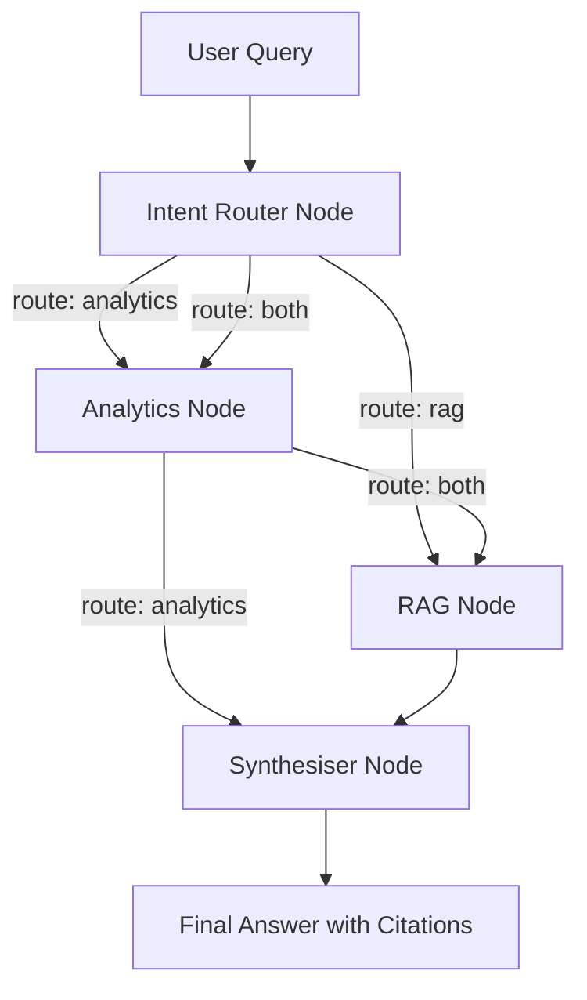

# 🛍️ AI Retail Decision Copilot

[](https://www.python.org/)
[](https://streamlit.io/)
[](https://github.com/langchain-ai/langgraph)
[](https://github.com/facebookresearch/faiss)
[](LICENSE)
[](run_tests.py)

> **An AI-powered decision support platform that combines Business Analytics, Retrieval-Augmented Generation (RAG), Machine Learning, and Large Language Models (LLMs) to help retail businesses make intelligent, data-driven decisions.**

---

## 📌 Project Overview

Retail businesses generate large volumes of structured data (sales, inventory, customer records) and unstructured data (reports, manuals, market research). Extracting meaningful insights from this information often requires multiple tools and technical expertise.

**AI Retail Decision Copilot** simplifies this process by combining business analytics, Retrieval-Augmented Generation (RAG), machine learning, and AI-powered conversational interfaces into a single intelligent platform.

Users can upload retail datasets and business documents, ask natural language questions, explore dashboards, retrieve information from documents, and receive actionable business recommendations.

This project is being developed as the foundation for a larger enterprise AI platform that will continue evolving throughout my third year.

---

## 🎯 Project Objectives

* **Analyze Retail Data:** Ingest and profile retail sales, inventory, and customer datasets.
* **Dynamic Conversational QA:** Answer business questions using natural language.
* **Context-Driven Routing:** Dynamically route queries to structured analytics, unstructured RAG, or both using LangGraph.
* **Document Intelligence:** Parse and retrieve information from uploaded business reports (PDF) using RAG and local FAISS vector search.
* **Intelligent Recommendations:** Synthesize statistical insights and policy text into logical business recommendations with proper source citation.
* **Visual Dashboards:** Generate interactive Plotly charts corresponding to natural language analytics queries.

---

## 📄 Project Documentation

Explore the detailed documentation for the design and system architecture:

| Document | Description |
| :--- | :--- |
| 📘 **[Design Document](docs/design_doc.md)** | Product overview, functional & non-functional requirements, technology stack, target users, and future scope. |
| 🏗️ **[Architecture Document](docs/architecture.md)** | Detailed system layout, Mermaid data flow diagrams, module responsibilities, and 3rd-year system evolution. |
| 📝 **[ADR-001](docs/adr/ADR-001.md)** | Architectural Decision Record explaining the transition to LangGraph StateGraph orchestration. |

---

## ✨ Key Features

### 📊 Business Analytics
* Category & product performance analysis (top/bottom performers).
* Monthly & quarterly sales trend analysis.
* Automated statistical anomaly detection with dynamic scatter charts.
* Interactive Plotly visualizations rendered dynamically.

### 📚 Document Intelligence (RAG)
* Text extraction and chunking of uploaded PDF documents.
* In-memory FAISS semantic index configuration.
* Automated citation injection referencing the source name and page number.

### 🤖 AI Conversational Copilot
* LangGraph state machine orchestrating stateless node transitions.
* Intent Router classifying queries dynamically.
* Multi-model provider integration (supporting OpenAI, Google Gemini, and Groq).
* Complete conversational history awareness.

---

## 🏗️ Tech Stack

| Layer | Component | Technology |
| :--- | :--- | :--- |
| **Frontend** | User Interface | Streamlit |
| **Backend** | Python Framework | LangGraph & LangChain |
| **Data Processing** | Numeric & Table Wrangling | Pandas, NumPy |
| **Visualization** | Interactive Plotting | Plotly |
| **Vector Database** | Semantic Retrieval Index | FAISS (Local) |
| **LLM Engine** | Large Language Models | OpenAI / Gemini / Groq |

---

## 📂 Repository Structure

The actual project structure is structured as a unified modular application:

```text
ai-retail-copilot/
│
├── demo/                           # Verification & walkthrough guides
│   └── README.md                   # Demo workflow and expectations
│
├── docs/                           # Project documentation
│   ├── adr/                        # Architectural Decision Records (ADRs)
│   │   └── ADR-001.md              # Decision record for LangGraph adoption
│   ├── design_doc.md               # Software design specifications
│   ├── architecture.md             # Detailed high-level system architecture
│   └── images/                     # System architecture diagrams
│
├── reports/                        # Submission status reports
│   ├── status-week2.md             # Week 2 progress status brief
│   ├── what-surprised-me.md        # Personal learning reflections
│   └── week2-github-issue.md       # Pre-formatted issue contents for submission
│
├── src/                            # Main application package
│   ├── analytics/                  # Data cleaning, profiling, and analytics logic
│   │   ├── analytics_engine.py     # Algorithms for top-n, trends, and anomalies
│   │   ├── chart_generator.py      # Plotly visualization builders
│   │   └── data_ingester.py        # CSV/Excel parsing and metadata profiling
│   │
│   ├── config/                     # Configuration and model initialization
│   │   └── config.py               # Key lookups and LLM loaders
│   │
│   ├── document_ingestion/         # Unstructured parsing
│   │   └── document_processor.py   # PDF text extraction and chunking
│   │
│   ├── graph_builder/              # LangGraph pipeline definition
│   │   └── graph_builder.py        # StateGraph nodes and conditional edges
│   │
│   ├── node/                       # Individual LangGraph nodes
│   │   ├── analytics_node.py       # Data analytics execution node
│   │   ├── intent_router.py        # Intent classification node
│   │   └── synthesiser_node.py     # Response generation & citation node
│   │
│   ├── prompts/                    # Prompts for LLM nodes
│   │   └── business_prompts.py     # Prompt templates for routing and synthesis
│   │
│   ├── state/                      # LangGraph state configuration
│   │   └── copilot_state.py        # Pydantic-based CopilotState schema
│   │
│   └── vectorstore/                # Vector store integrations
│   │   └── vectorstore.py          # FAISS manager & retriever client
│   └── __init__.py
│
├── tests/                          # Automated unit tests
│   ├── test_data_ingester.py       # Data cleaner & profiler tests
│   └── test_graph_flow.py          # LangGraph state transitions tests
│
├── requirements.txt                # Project python packages dependencies
├── run_tests.py                    # Unit test suite execution script
├── streamlit_app.py                # Main Streamlit user interface entrypoint
├── .env                            # Environment variables (local credentials)
└── README.md                       # Project landing documentation
```

---

## 🏗️ Architecture Overview

The system uses a directed graph built via **LangGraph StateGraph** to coordinate query routing. Rather than running a monolithic linear pipeline, the system evaluates the user's input semantic context and selects only the necessary processing path.



1. **Intent Router:** Evaluates user input and routes it based on intent. Uses a fast semantic classifier to choose `analytics`, `rag`, or `both`.
2. **Analytics Node:** Performs programmatic analysis (sales trend growth, top rankings, outlier z-scores) using Pandas.
3. **RAG Node:** References the local FAISS index to retrieve document excerpts if policy text is queried.
4. **Synthesizer:** Merges quantitative computation outputs and qualitative text chunks into a cohesive response citing specific files and page coordinates.

---

## ⚙️ Installation & Local Setup

### Prerequisites
* Python 3.9, 3.10, or 3.11 installed.
* An API Key for OpenAI, Google Gemini, or Groq.

### 1. Clone the Repository
```bash
git clone https://github.com/tanishkaarora/retailbrain.git
cd retailbrain
```

### 2. Configure Virtual Environment
```bash
python -m venv .venv
# On Windows (PowerShell)
.venv\Scripts\Activate.ps1
# On Linux/macOS
source .venv/bin/activate
```

### 3. Install Dependencies
```bash
pip install -r requirements.txt
```

### 4. Set Up Environment Keys
Create a `.env` file in the root directory:
```env
OPENAI_API_KEY="your-openai-api-key"
# Optional:
GEMINI_API_KEY="your-gemini-api-key"
GROQ_API_KEY="your-groq-api-key"
USE_GEMINI="false"
USE_GROQ="false"
```

---

## 🚀 Usage Guide

Once installation is complete:

1. **Run the App:**
   ```bash
   streamlit run streamlit_app.py
   ```
2. **Load Business Data:** Upload a CSV or Excel transaction sheet in the sidebar and click **🚀 Process Files**. This updates key metric cards and auto-generates tabular summary descriptions.
3. **Examine Dashboard Visualizations:** Click the **Charts** tab to explore automatically configured Plotly figures.
4. **Index Qualitative Reports:** Upload a business document PDF (like a policy guide or store handbook) in the sidebar. Click **🚀 Process Files** to construct the FAISS vector index.
5. **Interact in Chat:** Navigate to the **Ask** tab. Type a natural language question. The system routes the request automatically:
   * Quantitative queries (e.g., *"revenue trends"*) run analytics.
   * Qualitative queries (e.g., *"refund policy guidelines"*) run vector RAG.
   * Hybrid queries (e.g., *"compare Q3 growth to marketing strategy guidelines"*) run both and synthesize an answer citing sources.

---

## 🧪 Testing

Execute the automated test suites using the following commands:

* **Ingestion Tests:** Runs testing protocols on currency conversion, missing data imputations, and spreadsheet loads.
  ```bash
  python run_tests.py
  ```
* **Graph Flow Tests:** Headlessly mocks Streamlit variables and validates the LangGraph StateGraph routing.
  ```bash
  python tests/test_graph_flow.py
  ```

---

## 💡 What I Learned

1. **Orchestrating workflows with LangGraph StateGraph:** Migrating from a linear chain to a StateGraph architecture taught me how to manage execution pathways. Dynamic routing keeps prompts focused, prevents context pollution, and saves downstream API tokens by skipping document search for simple table calculations.
2. **Building resilient Data Ingestion for unstructured formats:** Retail transactions often come with diverse currency formatting ($, €, £, %). Writing preprocessors using regex in `data_ingester.py` taught me how to clean dirty strings into numbers without losing data.
3. **Decoupling application state from orchestrator memory:** Storing large objects like Pandas DataFrames inside the LangGraph state adds serialization overhead. A better approach is storing the DataFrame inside the local Streamlit session state and referencing only metadata and text context in the LangGraph `CopilotState`.
4. **Local Document Chunking & FAISS Vector Indexing:** Adjusting `RecursiveCharacterTextSplitter` variables (using a `chunk_size` of 600 and a `chunk_overlap` of 80) highlighted how indexing strategy directly impacts retrieval relevance.
5. **Handling empty database states gracefully:** When running graphs with components that rely on files, the system must handle missing assets (e.g., no CSV or PDF uploaded) without throwing uncaught exceptions. Designing fallbacks in nodes (like `AnalyticsNode` and `rag_node`) ensures application uptime.
6. **Decoupling UI code for testability:** Streamlit apps can be difficult to test headlessly. We learned to isolate analytical calculations and graph construction logic into separate modules (under `src/analytics/` and `src/graph_builder/`) so they can be unit-tested without launching a Streamlit browser session.
7. **Prompt engineering for hybrid synthesis:** Merging qualitative document text and numeric analytics tables requires fine-tuning system prompts. The synthesizer prompt teaches the LLM to write answers that reconcile calculations with textual guidelines, while outputting precise source citations.
8. **Interactive Visualizations with Plotly & Pandas:** Integrating automated plotting routines on freshly ingested tables showed me how to construct responsive charts based on columns types (bar chart for categories, line charts for dates, scatter plots for numerical correlations).

---

## 📊 Current Project Status

| Module | Status | Details |
| :--- | :--- | :--- |
| **Repository Setup** | ✅ Completed | Repository structure, requirements, and test suites are initialized. |
| **Design & Architecture** | ✅ Completed | Created design doc and architecture diagrams. |
| **Data Ingestion** | ✅ Completed | Implemented Pandas cleaning and metadata profiling. |
| **Analytics Engine** | ✅ Completed | Built calculations for trends, categories, anomalies, and Plotly visualization. |
| **RAG Pipeline** | ✅ Completed | Setup PDF text chunker and local FAISS vector database. |
| **Graph Orchestration** | ✅ Completed | Designed LangGraph StateGraph pipeline with routing. |
| **User Interface** | ✅ Completed | Streamlit chat widget, file upload drawers, and dashboards are live. |
| **Deployment** | ⏳ Planned | Preparation for production cloud hosting. |

---

## 📅 Weekly Progress (Week 0 & 1)

### ✅ Week 0 — Foundation & Architecture
* [x] Initialized Git repository and set up standard `.gitignore`.
* [x] Drafted system architecture, decoupled responsibilities, and designed data paths.
* [x] Drafted professional software design documentation.
* [x] Designed the interactive, unified Streamlit dashboard and chat user interface.

### ✅ Week 1 & 2 — Core Engine, LangGraph & Submission Prep
* [x] Built the Python Data Ingestion Pipeline to parse, clean, and profile spreadsheets.
* [x] Developed the business analytics algorithms (Top/Bottom, Trend, Anomaly Detection).
* [x] Implemented PDF chunking and embedded indexing in local FAISS.
* [x] Structured the LangGraph StateGraph to route user requests based on data context.
* [x] Fixed key bugs, resolved Pydantic 2.x deprecation warnings, and verified test suites.
* [x] Organized repository structure, documented ADR-001, and wrote the demo workflow.

---

---

## 👤 Author & Course Track

* **Author:** Tanishka Arora
* **Track:** Segment 3 — Foundations of Applied ML

---

## 🤝 Acknowledgements

Developed as part of my Summer Internship 2026. This project serves as the foundation for a long-term AI engineering project continuing through my third academic year.

---

## 📄 License

This project is licensed under the MIT License - see the LICENSE file for details.
