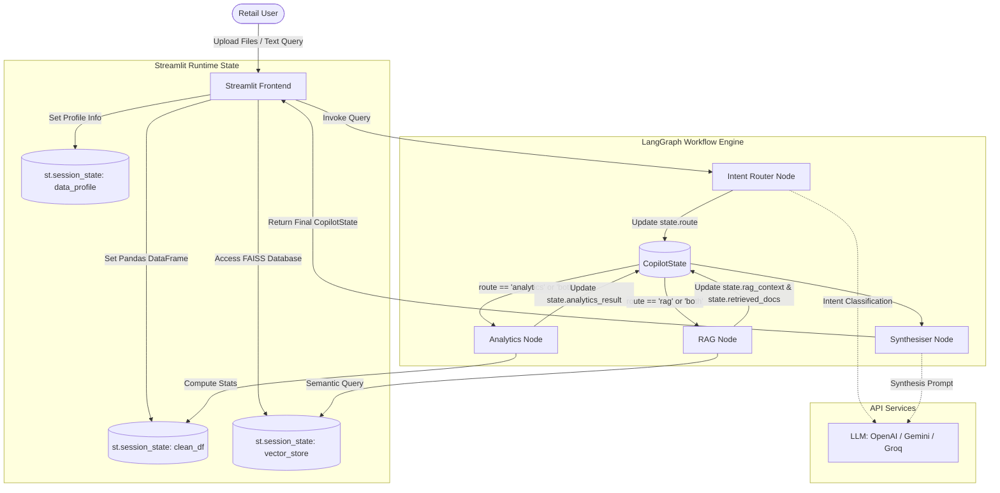
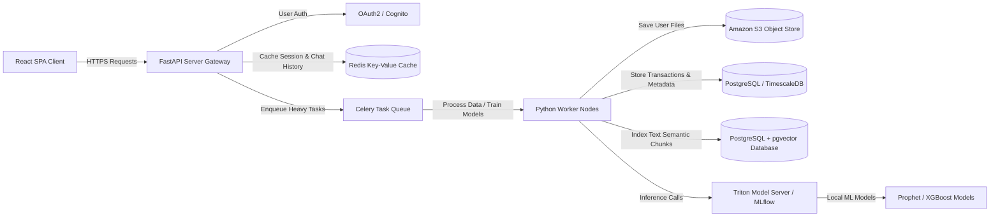

# System Architecture: AI Retail Decision Copilot

## 1. System Overview
The **AI Retail Decision Copilot** uses a modular, graph-driven architecture to orchestrate a combination of rule-based data operations, vector-based semantic retrieval, and generative AI synthesis. 

Unlike traditional linear pipeline systems, the copilot relies on **LangGraph** to model the execution state-machine. This allows the system to make routing decisions dynamically based on user intent and available local data files.

---

## 2. High-Level Architecture Diagram

The system's modular boundaries and component interactions are outlined in the diagram below:

---

## 3. Module Responsibilities

### 3.1 Frontend (User Interface)
* **Location:** [streamlit_app.py](file:///c:/Users/HP/OneDrive/Desktop/ai%20copilot/streamlit_app.py)
* **Responsibilities:**
  * Render file uploader widgets for CSV/Excel datasets and PDF business reports.
  * Hold transient session states (e.g., loaded Pandas DataFrames, file profiles, and the active vector store client).
  * Render interactive Plotly charts depending on the type of data returned.
  * Maintain the chat window, user message input, and streaming response displays.

### 3.2 Backend Orchestration (LangGraph Engine)
* **Location:** [src/graph_builder/](file:///c:/Users/HP/OneDrive/Desktop/ai%20copilot/src/graph_builder/) & [src/node/](file:///c:/Users/HP/OneDrive/Desktop/ai%20copilot/src/node/)
* **Responsibilities:**
  * Define the state schema ([CopilotState](file:///c:/Users/HP/OneDrive/Desktop/ai%20copilot/src/state/copilot_state.py)) representing the query context, route directions, analytics data extracts, retrieved text snippets, source citations, and final responses.
  * Define the [StateGraph](file:///c:/Users/HP/OneDrive/Desktop/ai%20copilot/src/graph_builder/graph_builder.py) structure, linking entry points, conditional branches, and terminate conditions.

### 3.3 Analytics Engine
* **Location:** [src/analytics/](file:///c:/Users/HP/OneDrive/Desktop/ai%20copilot/src/analytics/)
* **Responsibilities:**
  * Clean raw files: Standardize columns, parse datetime objects, handle missing records, and cast currency formatted strings to floating-point values.
  * Dataset profiling: Extract total rows, list of numeric columns, categorical segments, and temporal columns to generate a schema dict.
  * Core execution algorithms: Perform calculations (Top/Bottom Performers, Trend Analysis, Statistical Anomaly Detection).

### 3.4 Document Processing
* **Location:** [src/document_ingestion/](file:///c:/Users/HP/OneDrive/Desktop/ai%20copilot/src/document_ingestion/)
* **Responsibilities:**
  * Extract text lines from uploaded PDF documents.
  * Split document strings into smaller, semantic text chunks using configurable overlapping windows to maintain search context.

### 3.5 Vector Database
* **Location:** [src/vectorstore/](file:///c:/Users/HP/OneDrive/Desktop/ai%20copilot/src/vectorstore/)
* **Responsibilities:**
  * Initialize local **FAISS** indexes in-memory.
  * Encode raw text chunks into dense numeric vector embeddings.
  * Expose a similarity-search retriever client interface to match user queries with stored contexts.

---

## 4. Detailed Data & Control Flow

When a user submits a question, the request flows through the system in five distinct phases:

### Phase 1: Intent Classification (Routing)
1. The user's query is sent to the `IntentRouterNode`.
2. The router queries the active LLM with a classification-only prompt containing the question and information on whether a CSV data file has been loaded.
3. The LLM classifies the user query into one of three routes: `"analytics"`, `"rag"`, or `"both"`.

### Phase 2: Analytics Execution
1. If the route is `"analytics"` or `"both"`, the `AnalyticsNode` triggers.
2. The node pulls the cached DataFrame and dataset profile from the Streamlit session state.
3. It performs keyword parsing to select the correct analytical function:
   * Keywords like *top, best, highest* trigger Category Analysis.
   * Keywords like *trend, monthly, growth* trigger Trend Analysis.
   * Keywords like *anomaly, unusual, outlier* trigger Anomaly Detection.
   * General questions trigger a Full Dataset Summary.
4. The output summary string is saved into `state.analytics_result`.

### Phase 3: Semantic Retrieval (RAG)
1. If the route is `"rag"` or `"both"`, the `RAGNode` triggers.
2. The node pulls the active FAISS retriever.
3. It queries the retriever using the original user question to find the top 5 most similar document chunks.
4. The chunks are formatted into a single cohesive reference block (`state.rag_context`) and the original documents are stored in `state.retrieved_docs` for referencing.

### Phase 4: Business Synthesis
1. The `SynthesiserNode` runs next.
2. It extracts `state.analytics_result` and `state.rag_context`.
3. It formats a synthesis prompt combining the user's question, recent conversation history, computed analytics tables, and retrieved document passages.
4. The LLM generates a comprehensive, final business answer.
5. The node extracts source names and pages from `state.retrieved_docs` to append as formal citations.

### Phase 5: UI Rendering
1. The final `CopilotState` is returned to the Streamlit frontend.
2. The text answer and sources are rendered in the chat interface.
3. If `state.analytics_result` was populated, the UI calls the `ChartGenerator` to dynamically build Plotly charts (e.g., bar charts for category comparisons, line charts for trends, scatter plots for anomalies) and renders them inline.

---

## 5. 3rd-Year Architecture Evolution

To transition from the current prototype to an enterprise-grade SaaS platform, the architecture will evolve into the decoupled system model shown below:

### Key Upgrades:
1. **Decoupled Frontend/Backend:** Move away from Streamlit to a **React SPA** (UI) and a **FastAPI** backend to support rich web-interactions, concurrent user sessions, and API endpoints.
2. **Asynchronous Processing:** Introduce a **Celery** or Redis Queue to process large CSV dataset uploads and PDF vectorization asynchronously, preventing gateway request timeouts.
3. **Enterprise Storage:** Transition to **S3** for raw document files, **PostgreSQL** for transactional metadata, and **pgvector** for production-grade semantic search instead of local memory indexes.
4. **Dedicated ML Server:** Host demand forecasting models (e.g., Prophet, XGBoost) on a dedicated inference server (like Triton or MLflow) to handle heavy machine learning computation separately from the application backend.
